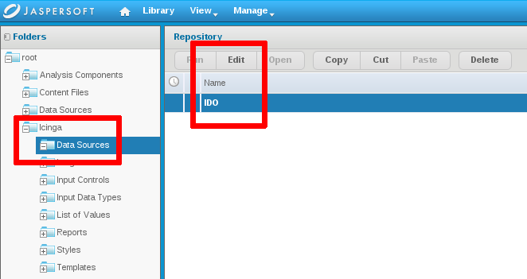

## Usage:
Open the webinterface, default credentials are jasperadmin:jasperadmin
http://127.0.0.1:8080/jasperserver

### IDO

Go to /root/Icinga/datasource (be sure that Refine contains "changed by anyone").

Icinga reporting datasource IDO

edit the existing datasource and configure your values.
- MySQL driver: com.mysql.jdbc.Driver 
- MySQL URL: jdbc:mysql://localhost:3306/icinga

Icinga reporting datasource ido mysql

test the configuration and save the connection.

all reports in our package point to this datasource and should be able to run.

